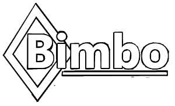

# Yunta - Enterprise Resource Planning

An [ERP][erp] system that uses a  ***microservices oriented*** architecture implemented using Docker containers. There are various services developed in different technologies, the tasks that lead you to the result are:

### Technologies we use

* .NET Core 2.2
* Entity Framework Core
* JWT Tokens
* Docker

>Note: This system is under a heavy development process, many of the propossed options are still under design and development.

## Architecture

All services are running inside Docker containers. [See architecture documentation](./docs/architecture.md). The main idea is to create an stable system that uses microservices in a transparent form, connecting each other using [BFF][bff] gateways that centralize the microservices access in a single point making easier and consistent the frontend development process.

It also includes other sub-projects that works around a core library and provides a centralized functionalities library. **Yunta** includes a set of T4 templates that generate WebAPI code from [POCO][poco] annotated objects in order to making easier the microservice development process. This also gives the possibility to enhace the services development speed by providing a base project structure to start the development process according to the **Yunta** standards.

## Manifesto

This software comes with a [manifesto](./docs/erp_manifesto.md) inspired in the **Debian GNU/Linux** manifesto in order to give things a little more of consistency to the written code and to define the objectives of this solution. Even when is not ***STRICTLY*** necesary to be follow is better if you read it to get a more general idea about what is this software about and why and where is heading to. We recomend you to read it.

## Intention

We do not have the intention to get rich with this software, at the begining it start just as a form to learn about [.NetCORE][netcore] mainly because many friend where talking about it and beacuse i was not satisfy with what other frameworks where giving, by now i think of it as a solution to many development needs a lot of developers -``mostly friends``- had. By using a centralized core and T4 templates we ensure that the code repetition could be reduced and with it the amount of spend time during development process.

## Whats Bimbo, Inc.

Well, you could read more about it in the [Manifesto](./docs/manifesto.md) file but you should know that **Bimbo, Inc** is an small group of developers gather in a simple group -``currently am the only developer **:D**, but hope to get some other contributors``- with the idea to provide a consistent and scalable platform for [SOHO][soho] companies, that requires god software solutions but with no to much budged, neither a professional development group.

## Author(s)

* Michel Pérez Saavedra: <michel.perez.saavedra@gmail.com>

# License

This software is provided under the terms of the **Bimbo, Inc** License which is a version of the **MIT License**. See the [License](./LICENSE) file for a more detailed information about the licenses terms.

>  __Bimbo, Inc License__
>
> Copyright (c) Bimbo, Inc. All rights reserved.
>
> Permission is hereby granted, free of charge, to any person obtaining a copy 
 of this software and associated documentation files (the "Software"), to deal
 in the Software without restriction, including without limitation the rights
 to use, copy, modify, merge, publish, distribute, sublicense, and/or sell
    copies of the Software, and to permit persons to whom the Software is
    furnished to do so, subject to the following conditions:
>
> The above copyright notice and this permission notice shall be included in all
  copies or substantial portions of the Software.
>
> THE SOFTWARE IS PROVIDED "AS IS", WITHOUT WARRANTY OF ANY KIND, EXPRESS OR
 IMPLIED, INCLUDING BUT NOT LIMITED TO THE WARRANTIES OF MERCHANTABILITY,
 FITNESS FOR A PARTICULAR PURPOSE AND NONINFRINGEMENT. IN NO EVENT SHALL THE
 AUTHORS OR COPYRIGHT HOLDERS BE LIABLE FOR ANY CLAIM, DAMAGES OR OTHER
 LIABILITY, WHETHER IN AN ACTION OF CONTRACT, TORT OR OTHERWISE, ARISING FROM,
 OUT OF OR IN CONNECTION WITH THE SOFTWARE OR THE USE OR OTHER DEALINGS IN THE
 SOFTWARE

[erp]: http://wikipedia.org/wiki/erp
[soho]: http://wikipedia.org/wiki/soho
[bff]: https://wikipedia.org/bff_software
[netcore]: https://microsoft.com/aspnetcore/exit

